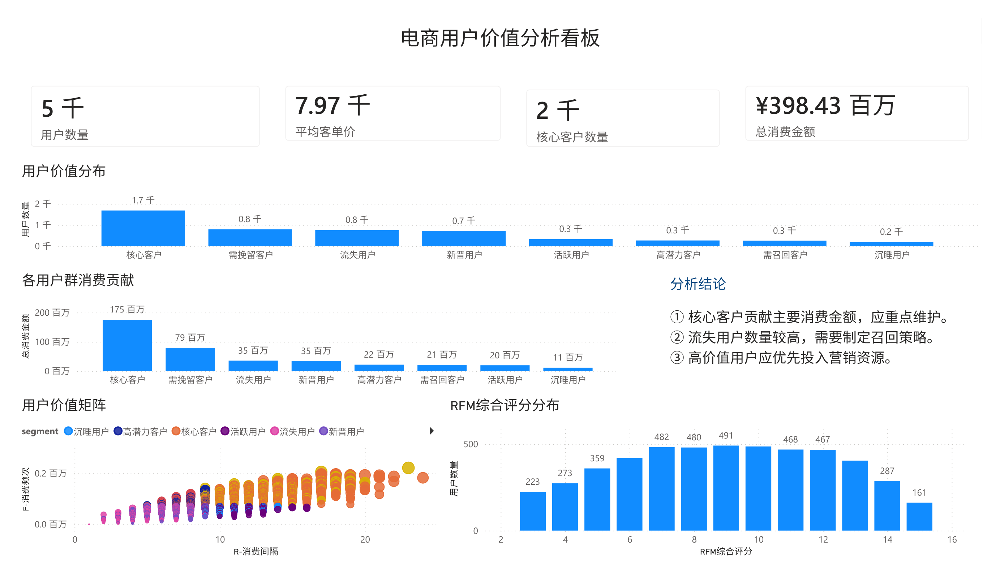
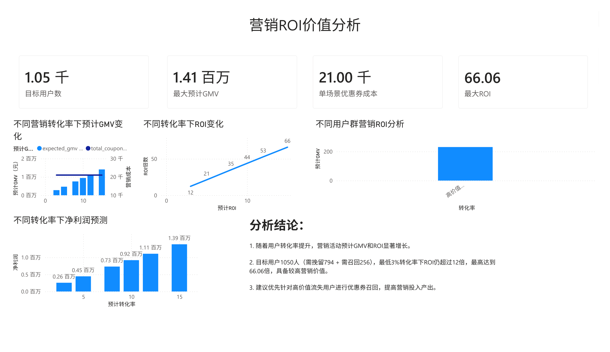
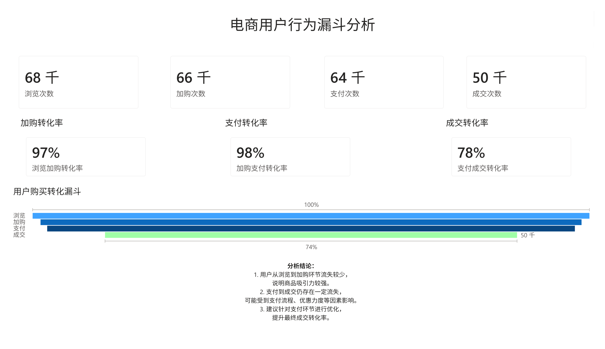
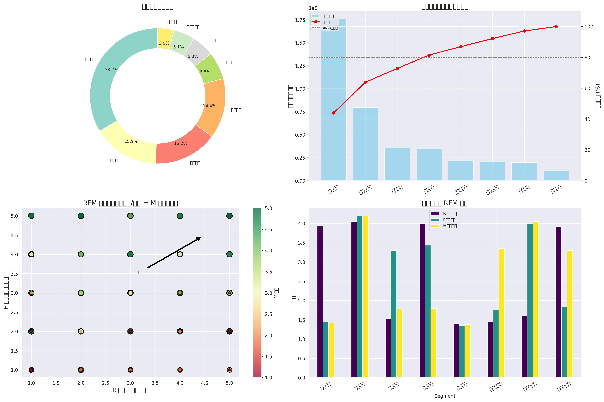
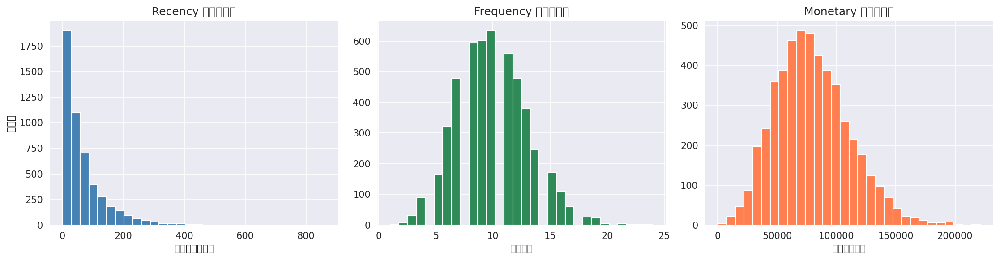
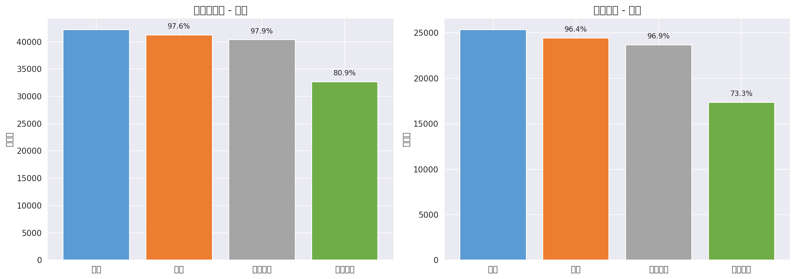

# 基于RFM模型的电商用户价值分析与运营策略优化

基于 RFM 模型对电商用户进行价值分层，并新增**货币化估值**——将技术指标强制转化为财务指标，输出"预期挽回GMV"金额，帮助运营团队评估营销动作到底值不值。

## Highlights

- **5000 用户 × 200 商品 × 50,000 订单**，覆盖两年半交易数据（2024.01 - 2026.06）
- 33.7% 核心客户贡献 **44.0% 营收**；21% 高价值流失预警客户人均消费超 ¥9.5 万
- 漏斗归因 + RFM 交叉分析：定位高价值用户在支付环节的转化优势
- 营销 ROI 敏感性分析：最低 3% 转化率下 ROI 仍超 12 倍，净收益 ¥25.7 万
- 技术栈闭环：MySQL(存储+跑批) → Python(RFM建模) → Power BI(可刷新仪表板)

## 项目结构

```
ecommerce-analysis/
│
├── README.md                        # 项目介绍
├── requirements.txt                 # Python 依赖
│
├── data/                            # 原始数据
│   ├── users.csv
│   ├── orders.csv
│   ├── products.csv
│   └── behavior_log.csv             # 用户行为数据（漏斗分析）
│
├── mysql/                           # 数据库脚本
│   ├── create_database.sql          # 创建数据库
│   ├── create_table.sql             # 建表（6张业务表 + 分析表）
│   └── import_data.sql              # 批量导入 CSV
│
├── sql/                             # 分析 SQL
│   ├── rfm_analysis.sql             # RFM 计算 + 打分 + 分层
│   ├── user_analysis.sql            # 分层汇总 + 业务分析
│   └── roi_analysis.sql             # 漏斗归因 + 营销ROI预测
│
├── python/                          # Python 脚本
│   ├── generate_ecommerce_data.py   # 生成模拟数据
│   ├── mysql_connect.py             # MySQL 连接工具
│   ├── data_clean.py                # 数据加载与清洗
│   ├── rfm_analysis.py              # RFM 模型（打分/分层/可视化）
│   └── roi_analysis.py              # ROI 预估 + 漏斗归因
│
├── notebook/                        # Jupyter 分析演示
│   └── rfm_analysis.ipynb
│
├── dashboard/                       # Power BI 仪表板
│   ├── ecommerce_dashboard.pbix
│   └── screenshots/
│       ├── pbi_page1_rfm.png
│       ├── pbi_page2_roi.png
│       └── pbi_page3_funnel.png
│
└── report/                          # 项目报告（含 PDF 报告与演示 PPT）
```

## 环境准备

使用 `data_env` conda 环境，或 pip 安装：

```bash
conda activate data_env
pip install -r requirements.txt
```

## 数据准备

### 生成模拟数据

```bash
conda activate data_env
python python/generate_ecommerce_data.py
```

### 导入 MySQL（可选）

```bash
# 1. 创建数据库
mysql -u root -p < mysql/create_database.sql
# 2. 建表
mysql -u root -p < mysql/create_table.sql
# 3. 导入 CSV
mysql -u root -p < mysql/import_data.sql
```

或使用 Python 一键导入：

```python
from python.mysql_connect import get_engine, import_all_csv
engine = get_engine()
import_all_csv(engine)
```

数据库连接凭据优先读环境变量 `MYSQL_USER` / `MYSQL_PASSWORD` / `MYSQL_DB`，否则读项目根目录 `db_config.json`（已 gitignore，不入库）：

```json
{"user": "root", "password": "你的密码", "db": "ecommerce"}
```

## RFM 分析

### 运行方式

```bash
# Jupyter Notebook（推荐面试演示）
conda activate data_env
jupyter notebook notebook/rfm_analysis.ipynb

# Python 脚本
python python/rfm_analysis.py       # RFM 建模 + 可视化
python python/roi_analysis.py        # ROI 预估 + 漏斗归因

# SQL 分析（需先导入数据）
# 三个脚本共享临时表和会话变量，必须在同一个会话中按顺序执行
cat sql/rfm_analysis.sql sql/user_analysis.sql sql/roi_analysis.sql | mysql -u root -p
```

SQL 脚本说明：

| 脚本 | 内容 |
|------|------|
| `sql/rfm_analysis.sql` | 企业核心指标、RFM 打分、用户分层、分析宽表 |
| `sql/user_analysis.sql` | 分层汇总统计、需召回用户分析、核心客户贡献度 |
| `sql/roi_analysis.sql` | 漏斗归因、高价值用户对比、营销ROI敏感性分析 |

### RFM 指标说明

| 指标 | 含义 | 计算方式 |
|------|------|----------|
| R (Recency) | 最近一次购买距今多少天 | 分析日期 - 最近订单日期 |
| F (Frequency) | 购买频率 | 用户订单总数 |
| M (Monetary) | 消费金额 | 用户累计消费总额 |

### 客户分层

| 层级 | R | F | M | 运营策略 |
|------|---|---|---|---------|
| 核心客户 | 高 | 高 | 高 | VIP 待遇，专属客服，优先体验 |
| 高潜力客户 | 高 | 低 | 高 | 推荐高附加值商品，提升客单价 |
| 需挽留客户 | 低 | 高 | 高 | 发券挽回，一对一沟通，发放大额优惠券 |
| 需召回客户 | 低 | 低 | 高 | 发券挽回，定向推送 + 限时折扣 |
| 活跃用户 | 高 | 高 | 低 | 引导升级消费，组合推荐 |
| 新晋用户 | 高 | 低 | 低 | 新手引导，首单优惠 |
| 沉睡用户 | 低 | 高 | 低 | 低价爆款唤醒，短信营销 |
| 流失用户 | 低 | 低 | 低 | 沉默成本评估，选择性放弃 |

> 高价值流失预警 = 需挽留客户 + 需召回客户（M 高、R 低），预估 GMV = 客单价 × 转化率 × 人数

## 可视化输出

### Power BI 仪表板







> 完整交互式仪表板：`dashboard/ecommerce_dashboard.pbix`
> 打印版看板：`report/ECOMMERCE_RFM_Dashboard.pdf`

### Python 可视化






